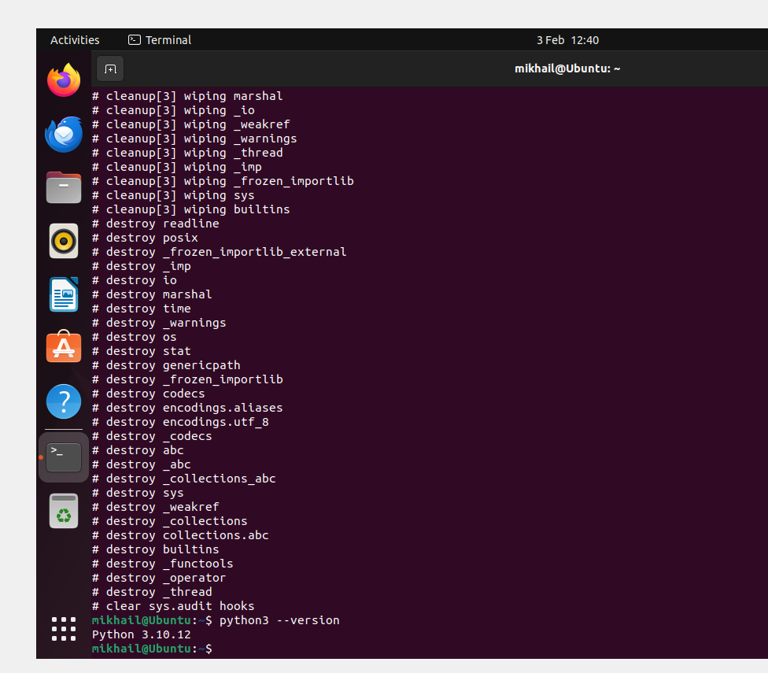
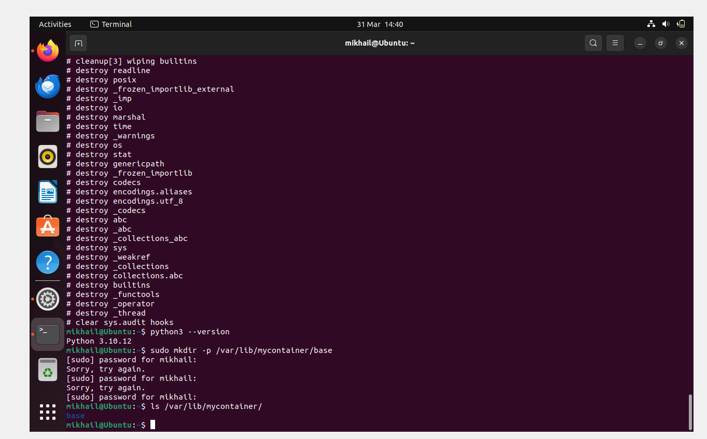
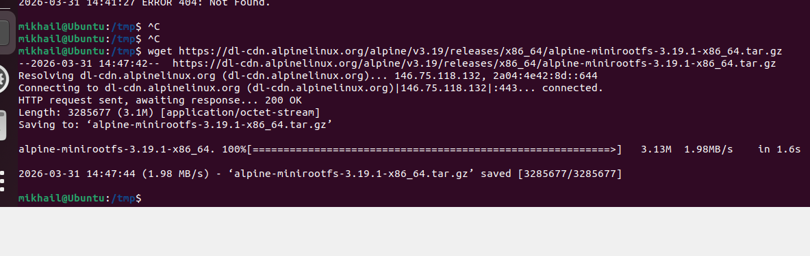
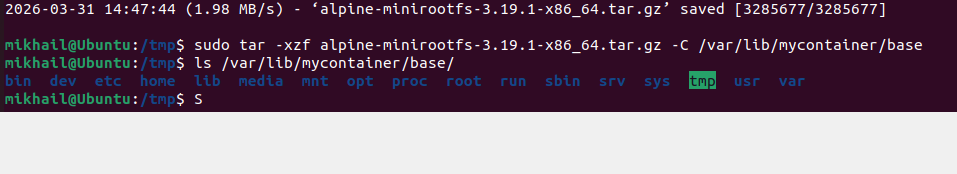
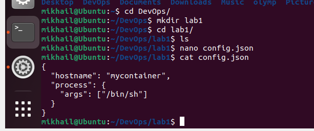
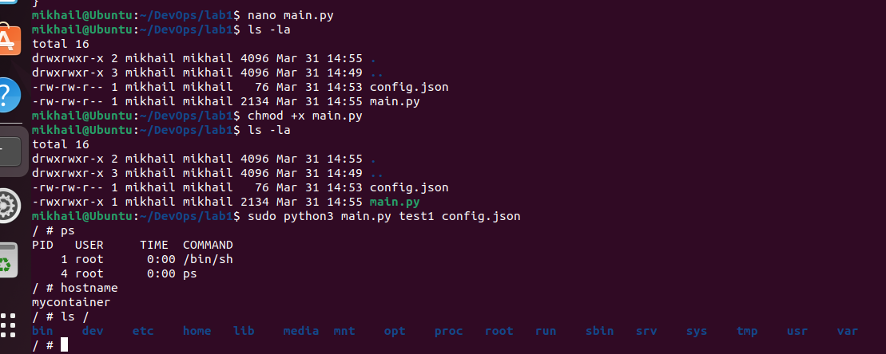
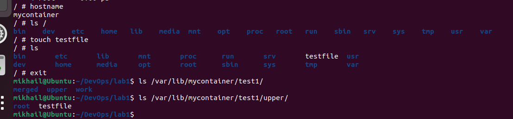

# Лабораторная работа 1

## Установка

Проверим установленный Python

Создадим `/var/lob/mycontainer/base` для дальнейшей работы

Далее скачаем alpine через архив в /tmp

Распакуем архив в созданную директорию и проверим через `ls /var/lib/mycontainer/base`

## Написание скрипта

В диретктории лабы был создан конфиг `config.json`

Также был создан и написан файл `main.py`, который отвечает за всю логику.

## Запуск

main.py был запущен и в нём были протестированы основные требования (PID, namespace, ls)

## Проверка overlayfs

Для првоерки внутри был создан файл testfile с выходом из контейнера. Этоот файл был найден в директории `/var/lib/mycontainer/test1/upper` - то есть всё сработало

