# Лабораторная работа 2

## Подготовка

Были установлены все необъодимые инструменты: **kubectl**, **minikube**, **helm**

Проверка установки

```
docker --version
kubectl version --client
minikube version
helm version
```

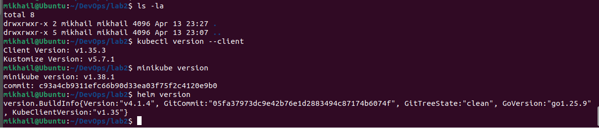

## Поднятие кластера и разворачивание сервиса

Далее был поднят кластер с помощью `minikube start --driver=docker`

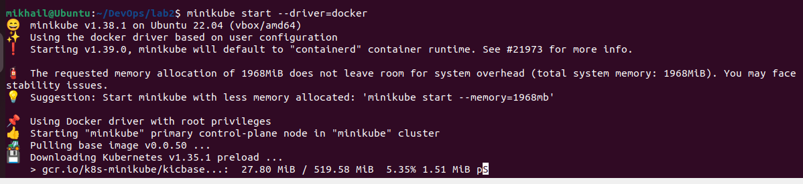

Проверка, что узел готов `kubectl get nodes`

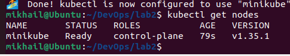

Для сервиса была создана папка k8s, в которой написан `app.yaml`, содержащий Namespace, Deployment, Service. В качестве сервиса был выбран nginxdemos/hello (Как иммитация отклика приложения на запрос в браузер).

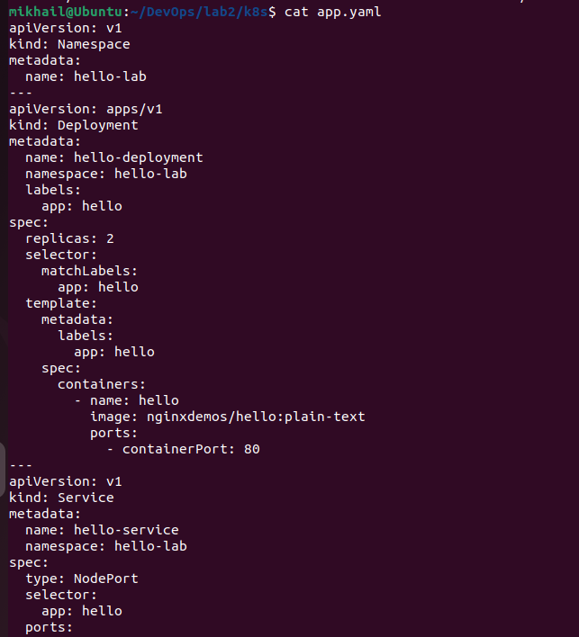

Был совершён деплой через команду `kubectl apply -f app.yaml`, а также проверка через `kubectl get all -n hello-lab`

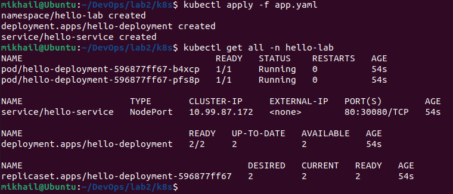

Далее сервис был открт в браузере `minikube service hello-service -n hello-lab --url`

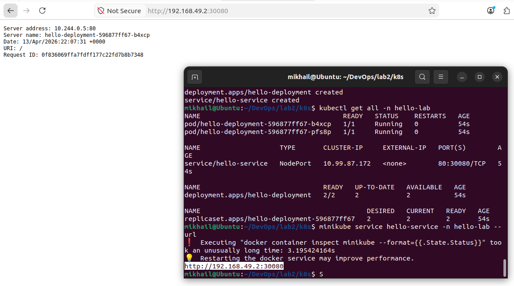

## Helm chart

Был создан скелет чарта через `helm create test-chart`

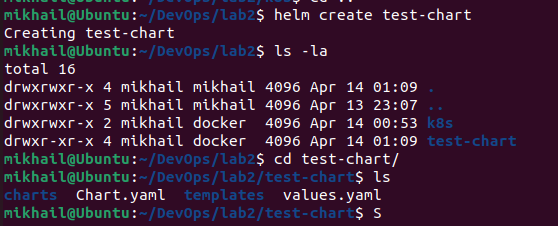

В `values.yaml` был заменён replicaCount и image

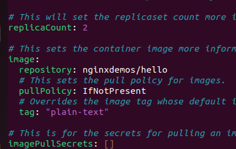

Далее была проведена проверка через lint и выведен итоговый манифест

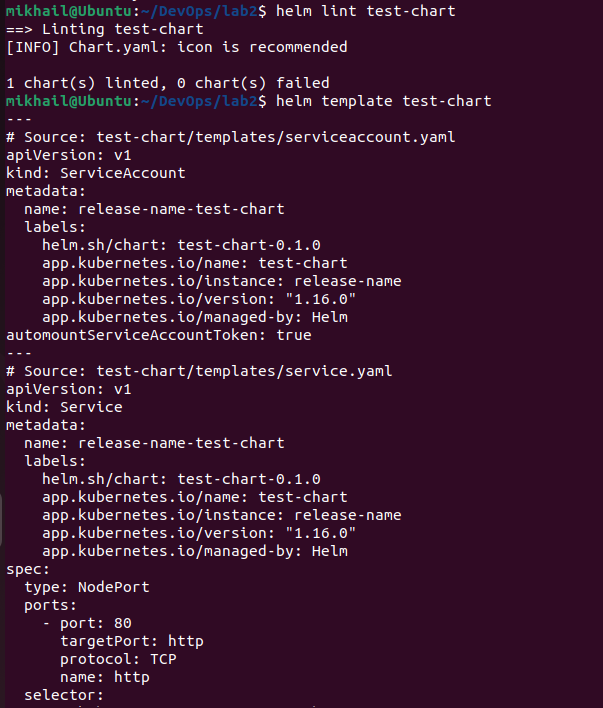

Чарт был задеплоен и проверен `helm list -n test-lab`, `kubectl get all -n test-lab`

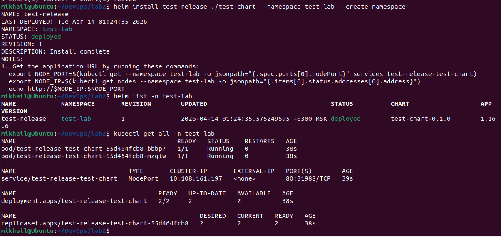

Далее открыт в браузере

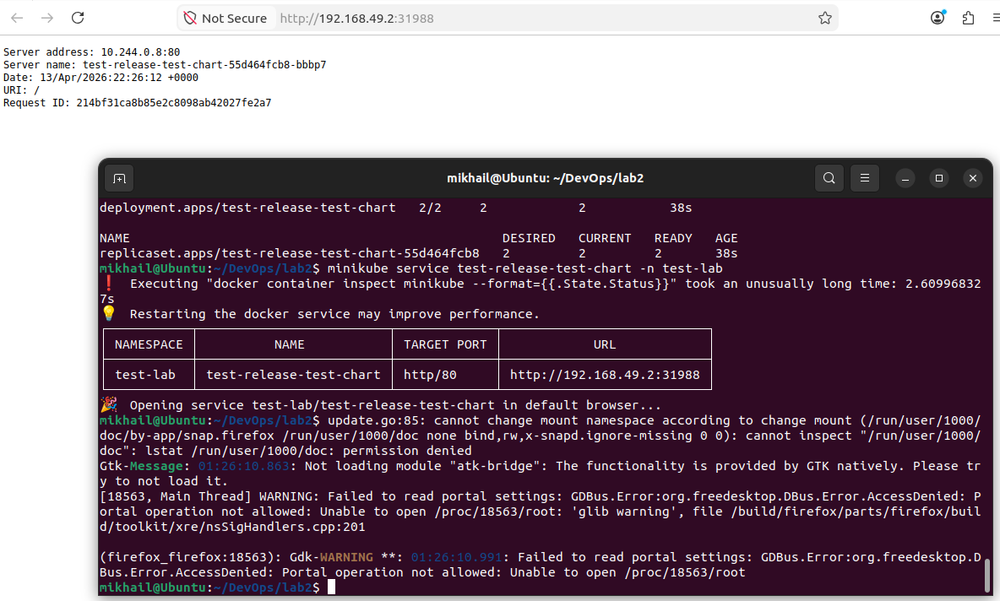

### Upgrade

Для изучения обновления было увеличено количество реплик до 4

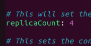

И прведён upgrade. Проверено появление новой ревизии, а также изменение количества подов.

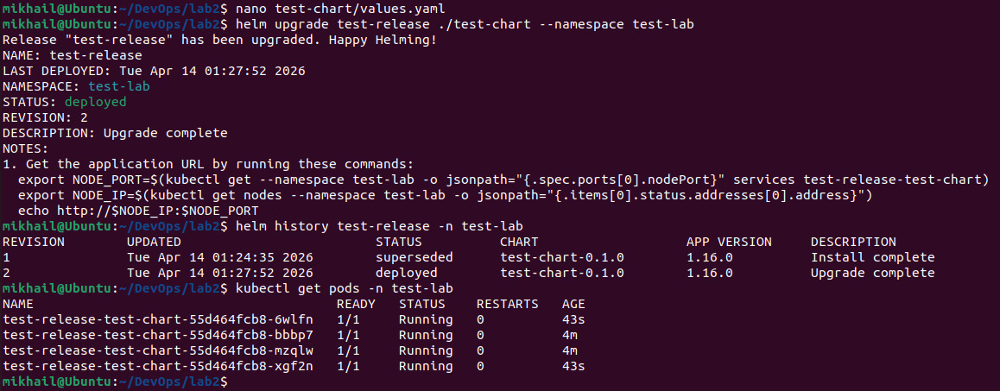

