# Лабораторная работа: настройка Nginx для двух pet-проектов

Нужно было настроить веб-сервер Nginx для двух pet-проектов на одном сервере с поддержкой HTTPS, виртуальных хостов и перенаправлением HTTP на HTTPS.

---

## Подготовка окружения

Обновляем пакеты и устанавливаем нужные инструменты

```bash
sudo apt update
sudo apt install nginx python3 python3-venv openssl -y
```

Проверяем, что Nginx запущен

```bash
sudo systemctl status nginx
```

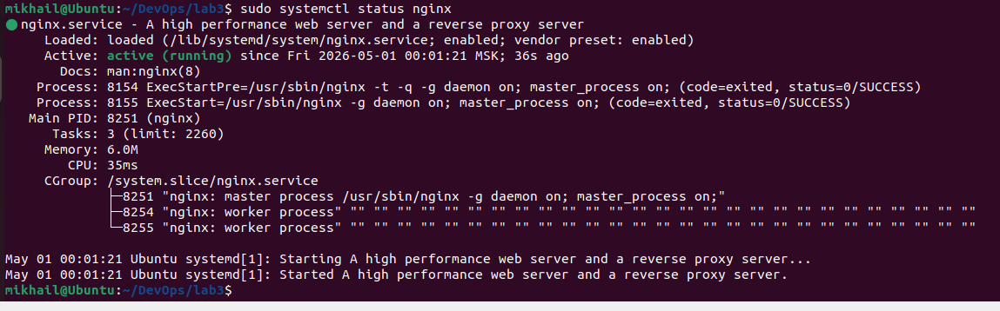

---

## Создание двух Python-приложений

### notes_app

Создаём папку и переходим в неё:

```bash
mkdir -p ~/projects/notes_app
cd ~/projects/notes_app
```

Создаём файл `app.py`:

```python
from http.server import BaseHTTPRequestHandler, HTTPServer

class App(BaseHTTPRequestHandler):
    def do_GET(self):
        self.send_response(200)
        self.send_header("Content-type", "text/html")
        self.end_headers()
        self.wfile.write(b"""
        <h1>Notes App</h1>
        <p>First pet project</p>
        """)

server = HTTPServer(("127.0.0.1", 8001), App)
server.serve_forever()
```

Запускаем приложение:

```bash
python3 app.py
```

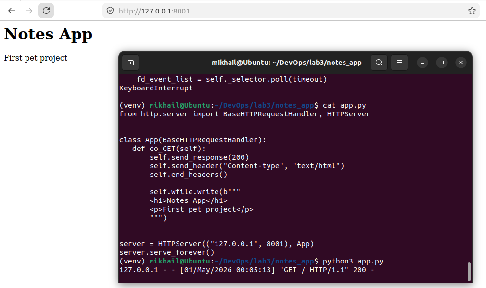

### Проект 2 — shop_app

Создаём папку и переходим в неё:

```bash
mkdir -p ~/projects/shop_app
cd ~/projects/shop_app
```

Создаём файл `app.py`:

```python
from http.server import BaseHTTPRequestHandler, HTTPServer

class App(BaseHTTPRequestHandler):
    def do_GET(self):
        self.send_response(200)
        self.send_header("Content-type", "text/html")
        self.end_headers()
        self.wfile.write(b"""
        <h1>Shop App</h1>
        <p>Second pet project</p>
        """)

server = HTTPServer(("127.0.0.1", 8002), App)
server.serve_forever()
```

Запускаем приложение:

```bash
python3 app.py
```

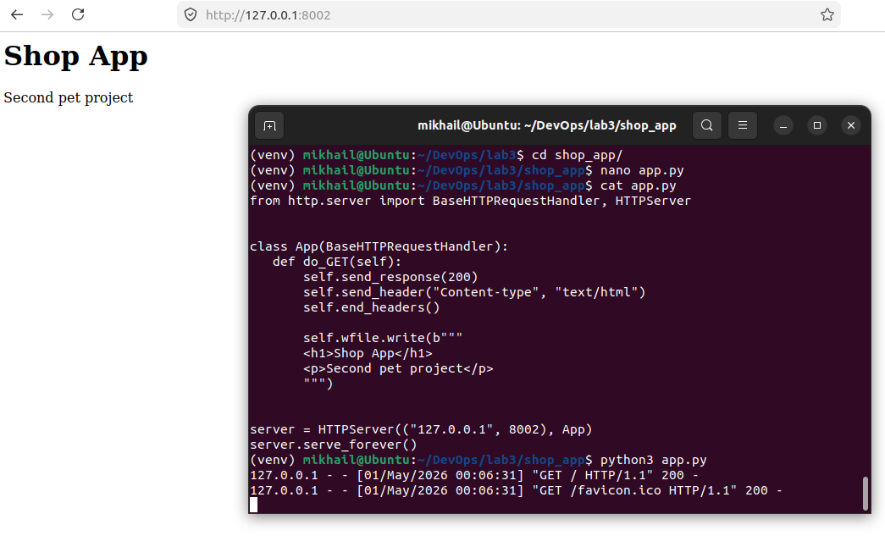

---

## Создание systemd-сервисов

Чтобы приложения запускались автоматически, оформляем их как systemd-сервисы.

### Сервис для notes_app

Открываем файл сервиса:

```bash
sudo nano /etc/systemd/system/notes_app.service
```

Вставляем содержимое:

```ini
[Unit]
Description=Notes App
After=network.target

[Service]
User=$USER
WorkingDirectory=/home/$USER/projects/notes_app
ExecStart=/usr/bin/python3 app.py
Restart=always

[Install]
WantedBy=multi-user.target
```

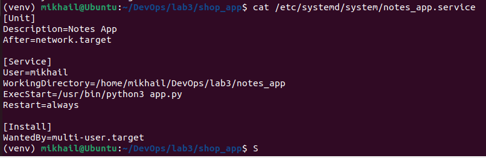

### Сервис для shop_app

```bash
sudo nano /etc/systemd/system/shop_app.service
```

```ini
[Unit]
Description=Shop App
After=network.target

[Service]
User=$USER
WorkingDirectory=/home/$USER/projects/shop_app
ExecStart=/usr/bin/python3 app.py
Restart=always

[Install]
WantedBy=multi-user.target
```

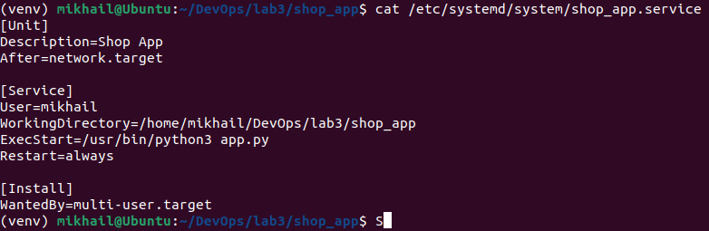

### Запускаем и включаем оба сервиса

```bash
sudo systemctl daemon-reload

sudo systemctl enable notes_app
sudo systemctl start notes_app

sudo systemctl enable shop_app
sudo systemctl start shop_app
```

Проверяем статус:

```bash
sudo systemctl status notes_app
sudo systemctl status shop_app
```

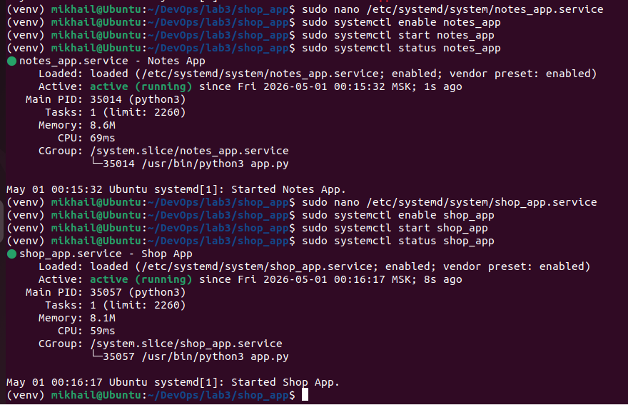

---

## Создание SSL-сертификата

Создаём папку для сертификатов:

```bash
sudo mkdir -p /etc/nginx/ssl
```

Генерируем самоподписанный сертификат на 365 дней:

```bash
sudo openssl req -x509 -nodes -days 365 \
  -newkey rsa:2048 \
  -keyout /etc/nginx/ssl/nginx.key \
  -out /etc/nginx/ssl/nginx.crt
```

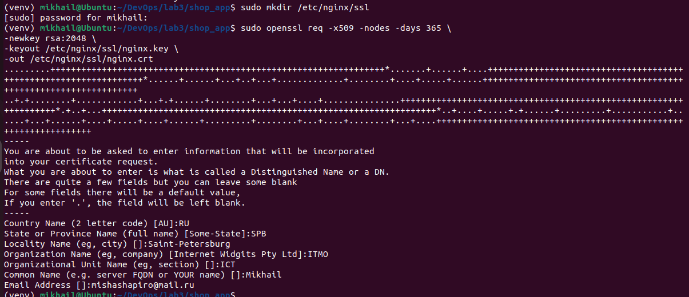

---

## Настройка виртуальных хостов Nginx

### Конфиг для notes.local

```bash
sudo nano /etc/nginx/sites-available/notes.local
```

Содержимое конфига:

```nginx
server {
    listen 80;
    server_name notes.local;
    return 301 https://$host$request_uri;
}

server {
    listen 443 ssl;
    server_name notes.local;

    ssl_certificate /etc/nginx/ssl/nginx.crt;
    ssl_certificate_key /etc/nginx/ssl/nginx.key;

    location / {
        proxy_pass http://127.0.0.1:8001;
    }

    location /static/ {
        alias /var/www/notes_static/;
    }
}
```

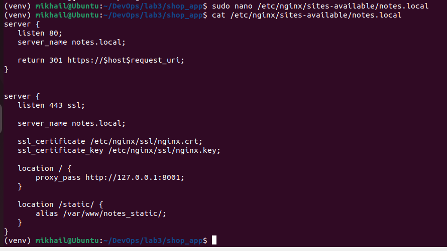

### Конфиг для shop.local

```bash
sudo nano /etc/nginx/sites-available/shop.local
```

```nginx
server {
    listen 80;
    server_name shop.local;
    return 301 https://$host$request_uri;
}

server {
    listen 443 ssl;
    server_name shop.local;

    ssl_certificate /etc/nginx/ssl/nginx.crt;
    ssl_certificate_key /etc/nginx/ssl/nginx.key;

    location / {
        proxy_pass http://127.0.0.1:8002;
    }

    location /images/ {
        alias /var/www/shop_images/;
    }
}
```

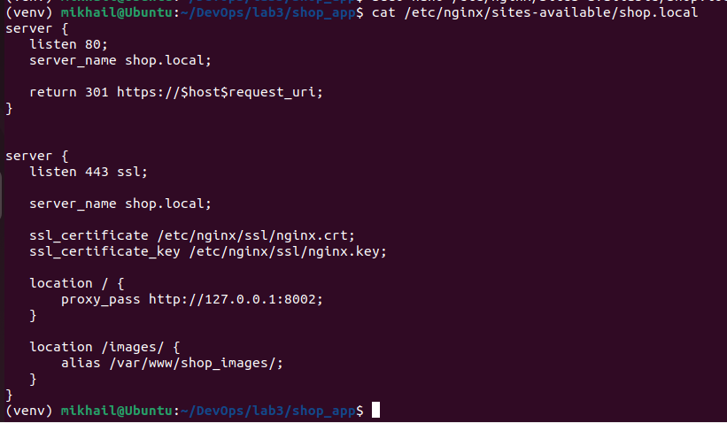

---

## Создание директорий для alias

Создаём папки для статических файлов:

```bash
sudo mkdir -p /var/www/notes_static
sudo mkdir -p /var/www/shop_images
```

Добавляем тестовые файлы:

```bash
echo "Notes static file" | sudo tee /var/www/notes_static/test.txt
echo "Shop image file"   | sudo tee /var/www/shop_images/test.txt
```

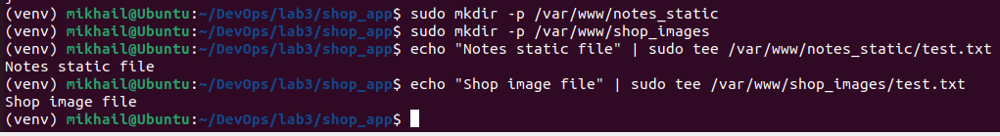

---

## Активация конфигураций Nginx

Создаём символические ссылки в `sites-enabled`:

```bash
sudo ln -s /etc/nginx/sites-available/notes.local /etc/nginx/sites-enabled/
sudo ln -s /etc/nginx/sites-available/shop.local  /etc/nginx/sites-enabled/
```

Проверяем конфиг на ошибки:

```bash
sudo nginx -t
```

Перезапускаем Nginx:

```bash
sudo systemctl restart nginx
```

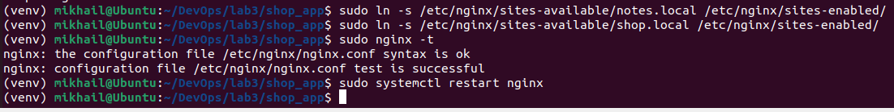

---

## Настройка hosts

Нужно добавить записи в файл hosts, чтобы браузер знал, куда обращаться.

```bash
sudo nano /etc/hosts
```

Добавляем строки:

```
127.0.0.1 notes.local
127.0.0.1 shop.local
```

---

## Проверка работы

Открываем браузер и переходим по адресам.

**notes_app:** переходим по `http://notes.local` — должен произойти редирект на `https://notes.local`.

**shop_app:** открываем `https://shop.local`.

**Проверяем alias:**

- `https://notes.local/static/test.txt`
- `https://shop.local/images/test.txt`

Результаты в браузере:

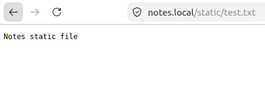
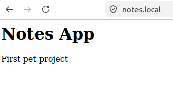
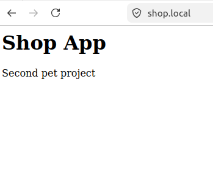
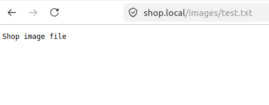

